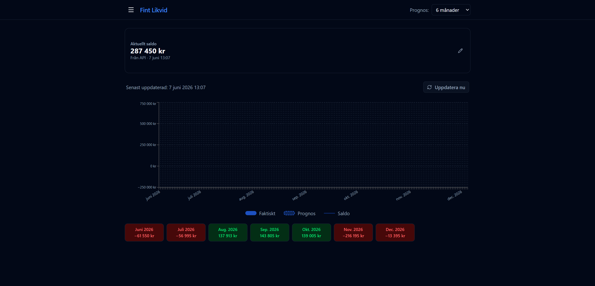

# Instrumentpanel

URL: `/`

Startsidan ger en snabb överblick över företagets likviditet.

## Komponenter

### Aktuellt saldo
Visar kontobehållningen hämtad från Wint API. Bredvid saldot visas källa ("Från API" eller "Manuellt") och tidpunkt för senaste uppdatering.

- **Pennikonen** öppnar ett fält där du kan skriva in ett manuellt saldo, t.ex. om Wint-datan inte stämmer. Det manuella saldot används tills API:et rapporterar ett nytt värde.
- **Uppdatera nu** tvångshämtar färsk data från Wint direkt, utan att vänta på nästa automatiska uppdatering (standardintervall 6 timmar).

### Likviditetsgrafen
Interaktiv graf som visar kassaflöden och löpande saldo från och med idag:

- **Blå staplar** — faktiska kassaflödeshändelser (bokförda i Wint)
- **Streckade staplar** — prognostiserade händelser (beräknade av systemet)
- **Mörk linje** — löpande kontosaldo dag för dag

Håll muspekaren över grafen för att se detaljer per dag.

### Månadssammanfattning
Scrollbara kort nedanför grafen visar totalt nettokassaflöde per hel kalendermånad.

| Färg | Betydelse |
|------|-----------|
| Grön | Positivt kassaflöde den månaden |
| Röd | Negativt kassaflöde den månaden |

Exemplet ovan (6 månaders prognos, juni–december 2026):

| Månad | Kassaflöde |
|-------|-----------|
| Juni 2026 | −61 550 kr |
| Juli 2026 | −56 995 kr |
| Aug. 2026 | +137 913 kr |
| Sep. 2026 | +143 805 kr |
| Okt. 2026 | +139 005 kr |
| Nov. 2026 | −216 195 kr |
| Dec. 2026 | −13 395 kr |

## Prognosperiod
Välj 1–24 månader i headerns dropdown. Alla vyer i appen uppdateras direkt.
