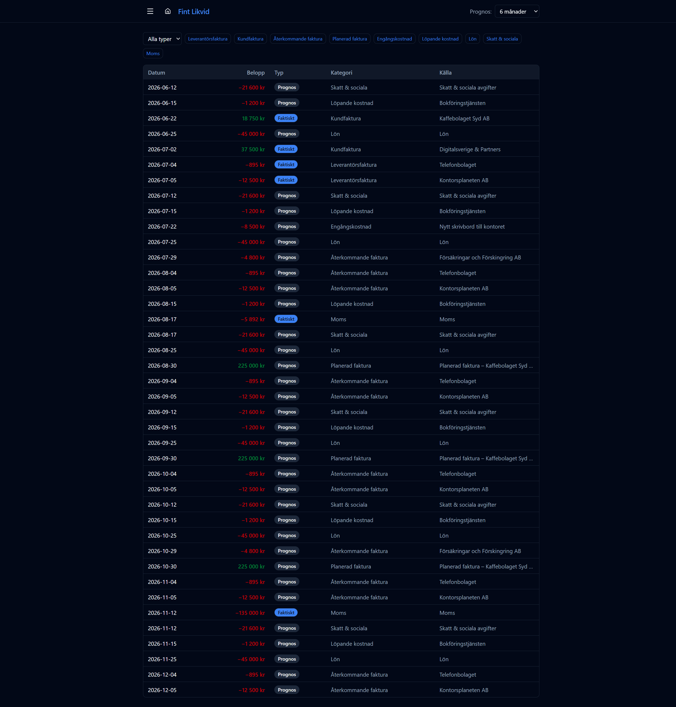

# Detaljer & händelser

URL: `/details`

En fullständig tabell med alla enskilda kassaflödeshändelser från och med dagens datum, sorterade kronologiskt.

## Kolumner

| Kolumn | Beskrivning |
|--------|-------------|
| Datum | Betalningsdatum för händelsen |
| Belopp | Positivt = inbetalning, negativt = utbetalning |
| Typ | **Faktiskt** (bokfört i Wint) eller **Prognos** (beräknat) |
| Kategori | Se kategorier nedan |
| Källa | Namn på kund, leverantör eller regelnamn |

## Kategorier

| Kategori | Ursprung |
|----------|----------|
| Kundfaktura | Utgående faktura bokförd i Wint |
| Leverantörsfaktura | Inkommande faktura bokförd i Wint |
| Återkommande faktura | Projicerad leverantörsfaktura (konfigurerad under [Återkommande fakturor](03-recurring-invoices.md)) |
| Planerad faktura | Planerad utgående faktura (konfigurerad under [Planerade fakturor](04-future-invoices.md)) |
| Lön | Löneutbetalning den 25:e varje månad |
| Skatt & sociala | Skatt och sociala avgifter den 12:e (17:e i augusti) |
| Moms | Kvartalsvis momsredovisning enligt svenska regler |
| Engångskostnad | Manuellt inlagd enstaka utgift |
| Löpande kostnad | Återkommande fast utgift |

## Filtrering

- **Typ-dropdown** (överst till vänster) — visa alla, bara faktiska eller bara prognoser
- **Kategoriknapparna** — klicka för att dölja/visa enskilda kategorier; aktiv = visas, inaktiv = dold
