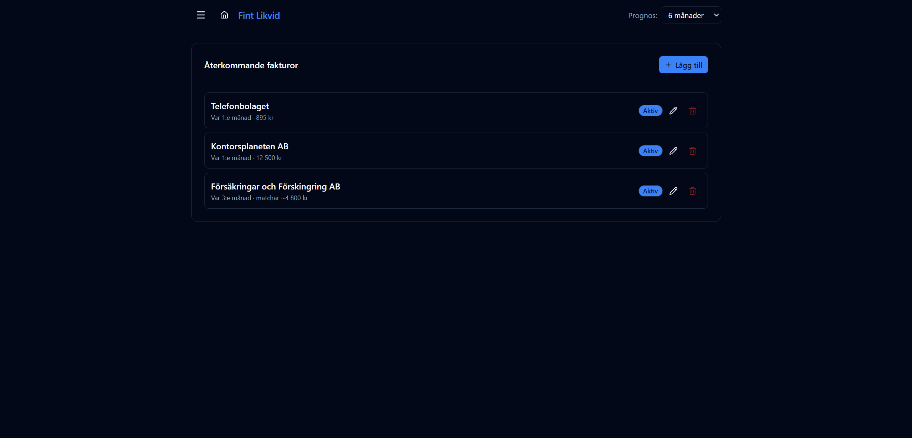

# Återkommande fakturor

URL: `/recurring`

Konfigurera leverantörsfakturor som förväntas återkomma med jämna mellanrum. Systemet projicerar framtida betalningar baserat på den senaste faktiska fakturan i Wint-datan.

## Hur det fungerar

1. Du anger ett leverantörsnamn och ett intervall i månader (1–12).
2. Systemet hittar den senaste faktiska fakturan från den leverantören i Wint.
3. Betalningsdatumet för prognosen baseras på den fakturans betaldatum (eller förfallodatum om betaldatum saknas).
4. Framtida förekomster projiceras var X:e månad upp till 24 månaders horisont.
5. Fakturor med beräknat betalningsdatum inom 14 dagar visas inte som prognos (de antas redan vara bokförda eller nära nog).

## Demo-data

| Leverantör | Intervall | Belopp |
|-----------|-----------|--------|
| Telefonbolaget | Var 1:a månad | 895 kr |
| Kontorsplaneten AB | Var 1:a månad | 12 500 kr |
| Försäkringar och Förskingring AB | Var 3:e månad | ~4 800 kr |

## Lägga till / redigera

Klicka **Lägg till** för en ny post. Klicka på en befintlig posts redigeringsknapp (pennikon / tre punkter) för att:

- Ändra leverantörsnamn
- Ändra intervallet
- Överstyrka beloppet om du vet att nästa faktura avviker från den senaste
- Inaktivera utan att ta bort
