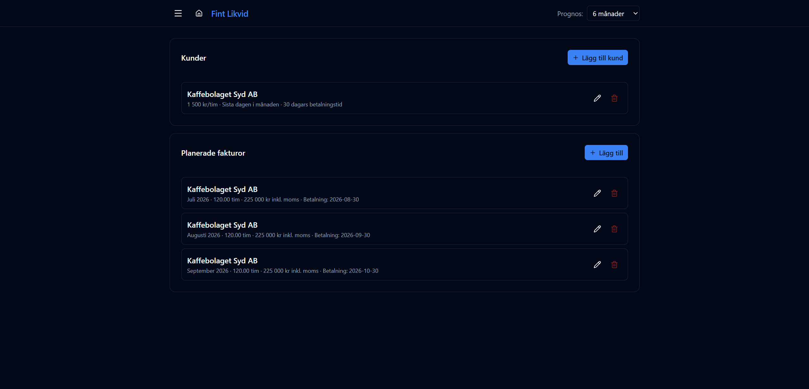
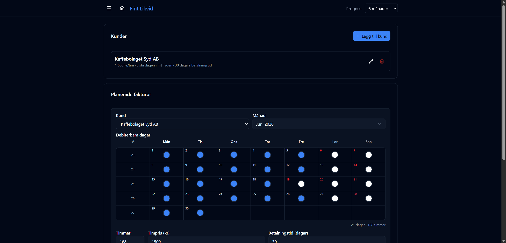
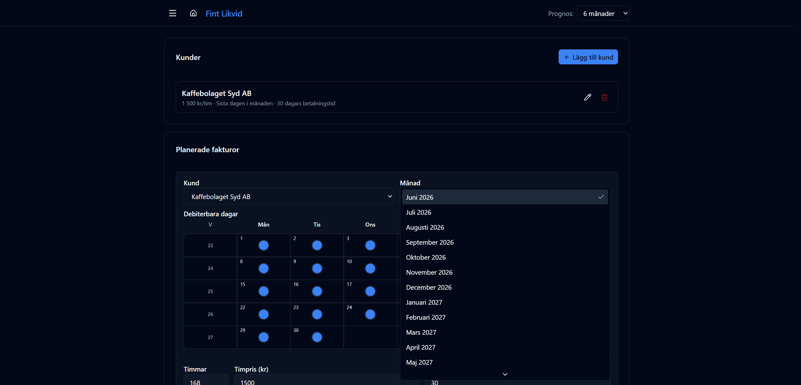
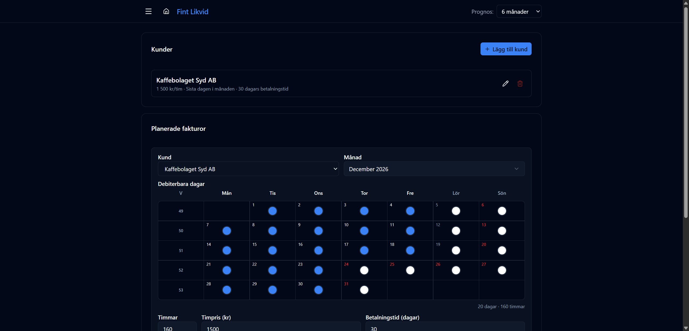
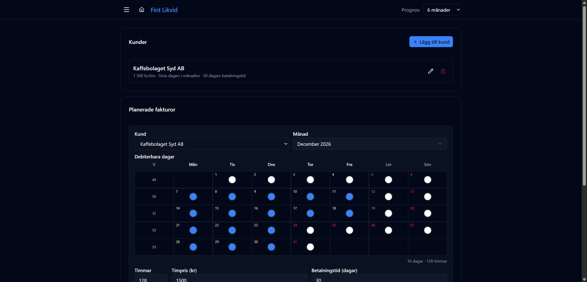
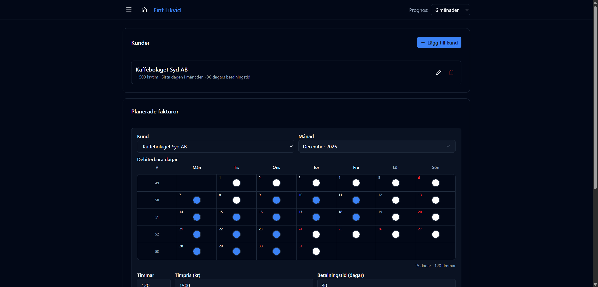
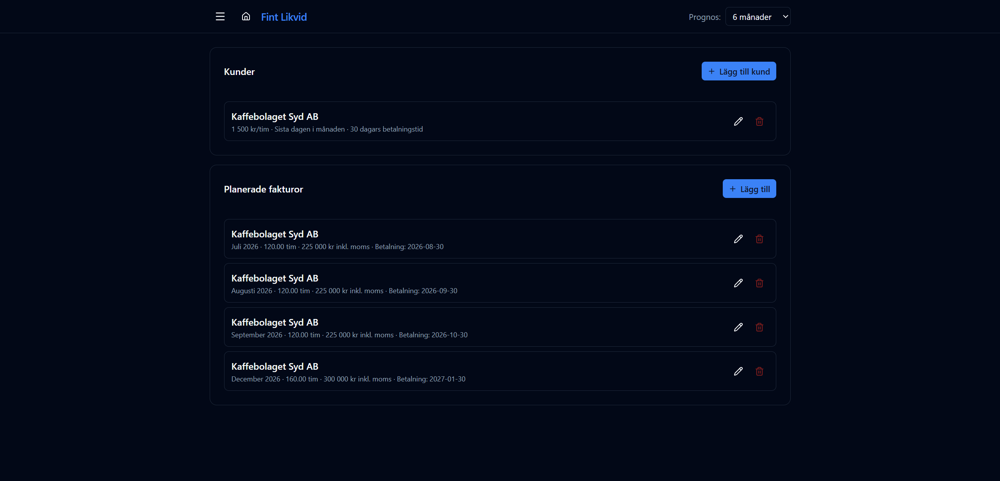
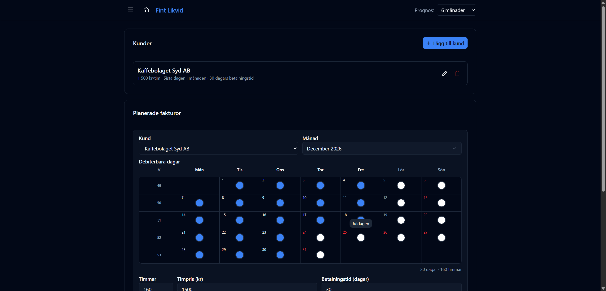

# Planerade fakturor

URL: `/future-invoices`

Planera framtida utgående fakturor baserat på debiterbara timmar och kundmallar. Varje planerad faktura visas som en inbetalningsprognos i grafen och detaljtabellen.

## Arbetsflöde

### 1. Lägg till en kund
Under **Kunder**-kortet klickar du **Lägg till kund** och anger:

| Fält | Beskrivning |
|------|-------------|
| Namn | Kundnamn — kan väljas bland faktiska mottagare från Wint eller skrivas fritt |
| Timpris | Pris per timme exkl. moms |
| Betalningstid (dagar) | Antal dagar från fakturadatum till förväntad betalning |
| Fakturadatumregel | Se nedan |

**Fakturadatumregler:**
- *Sista dagen i månaden* — t.ex. 31 december
- *Sista arbetsdagen* — hänsyn till svenska helgdagar
- *Första dagen nästa månad* — t.ex. 1 januari
- *Första arbetsdagen nästa månad* — hänsyn till svenska helgdagar

### 2. Skapa en planerad faktura
Klicka **Lägg till** under **Planerade fakturor** och välj kund och månad. En kalender visas med alla dagar i månaden.

### 3. Välj månad
Öppna månadsväljaren och välj önskad månad (upp till 24 månader framåt).

---

## Debiterbara dagar — kalendervy

När en månad är vald visas en kalender med alla dagar. Här väljer du exakt vilka dagar som ska debiteras.

Timmar, timpris och betalningstid räknas om automatiskt och visas direkt under kalendern:
- **Fakturadatum** — beräknat utifrån kundens fakturadatumregel
- **Belopp inkl. moms** — `timmar × timpris × 1,25`
- **Förväntad betalning** — fakturadatum + betalningstid

### Växla hela veckor (klick på veckonummer)

Klicka på ett veckonummer (t.ex. **V49**) för att markera eller avmarkera alla arbetsdagar i den veckan på en gång.

### Växla enstaka dagar (klick på dag)

Klicka direkt på en dag för att markera eller avmarkera just den dagen.

### Halva dagar (högerklick på dag)

Högerklicka på en dag för att välja hur stor del av dagen som ska debiteras:

| Alternativ | Timmar |
|-----------|--------|
| Hel dag | 8h |
| ¾ dag | 6h |
| ½ dag | 4h |
| ¼ dag | 2h |
| Ledig | 0h (dagen avmarkeras) |

Dagar med halv- eller kvartstid visas med en markering i kalendern.

---

## Svenska helgdagar är inbyggda

Röda dagar och klämdagar är förvalda i systemet. Helgdagar syns grå/inaktiva i kalendern och ingår inte i det automatiska dagantalet. Håll muspekaren över en helgdag för att se namnet.

I exemplet ovan (december 2026) exkluderas **Juldagen (25/12)** och **Annandag jul (26/12)** automatiskt — det totala antalet debiterbara dagar beräknas till **20 dagar / 160 timmar** utan att du behöver justera något manuellt.

---

## Demo-data

**Kund:** Kaffebolaget Syd AB — 1 500 kr/tim, sista dagen i månaden, 30 dagars betalningstid

| Månad | Timmar | Belopp inkl. moms | Betalning |
|-------|--------|-------------------|-----------|
| Juli 2026 | 120 tim | 225 000 kr | 2026-08-30 |
| Augusti 2026 | 120 tim | 225 000 kr | 2026-09-30 |
| September 2026 | 120 tim | 225 000 kr | 2026-10-30 |
