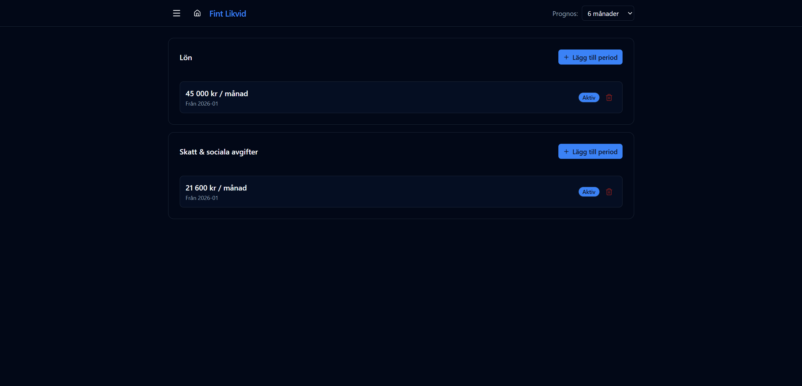

# Lön & skatt

URL: `/salary`

Konfigurera löne- och skattebelopp som inkluderas i likviditetsprognosen. Beloppen anges per period med ett startdatum, vilket gör det möjligt att modellera löneförändringar över tid.

## Lön

- Utbetalas den **25:e varje månad**
- Ange nettobelopp per månad
- Flera perioder med olika belopp kan läggas in — den senaste aktiva perioden används

**Demo:** 45 000 kr/månad från 2026-01

## Skatt & sociala avgifter

- Betalas den **12:e varje månad** (undantag: **17:e i augusti**)
- Ange totalt belopp per månad (arbetsgivaravgift + preliminärskatt)
- Stöder även flera perioder

**Demo:** 21 600 kr/månad från 2026-01

## Perioder

Klicka **Lägg till period** för att lägga till en ny rad med nytt belopp och startdatum. Redigera eller ta bort en befintlig period via redigeringsknappen på raden.

> Beloppen syns i detaljtabellen under kategorierna **Lön** respektive **Skatt & sociala**.
