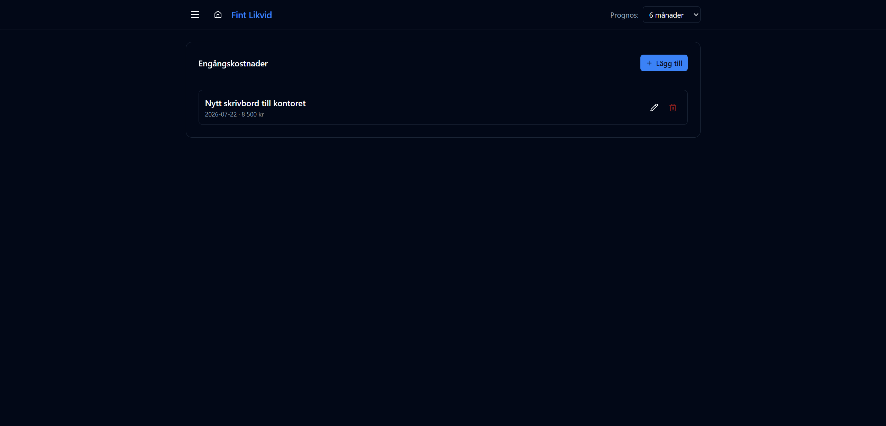

# Engångskostnader

URL: `/expenses`

Lägg till enstaka planerade utgifter som inte tillhör någon återkommande kategori — t.ex. utrustningsköp, konsulttjänster eller engångsprenumerationer.

## Fält

| Fält | Beskrivning |
|------|-------------|
| Beskrivning | Fritext, visas som källa i detaljtabellen |
| Belopp | Utgiftsbelopp i SEK |
| Datum | Förväntat betalningsdatum |

## Demo-data

| Beskrivning | Datum | Belopp |
|-------------|-------|--------|
| Nytt skrivbord till kontoret | 2026-07-22 | 8 500 kr |

## Hantering

- Klicka **Lägg till** för en ny engångskostnad
- Klicka papperskorgsikonen för att ta bort
- Klicka redigeringsknappen (tre punkter) för att ändra beskrivning, belopp eller datum

Posten visas i grafen och detaljtabellen under kategorin **Engångskostnad** med status **Prognos**.
