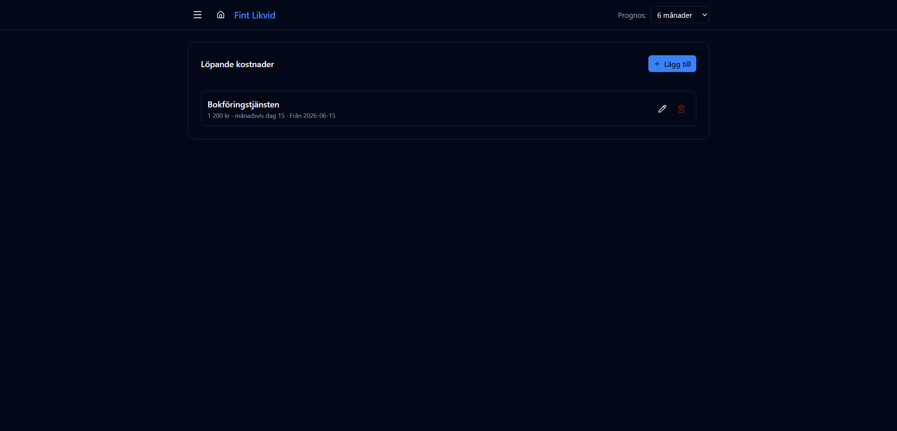

# Löpande kostnader

URL: `/periodic`

Återkommande fasta utgifter med känt belopp — t.ex. abonnemang, kortavgifter och tjänster som faktureras regelbundet men inte syns i Wint som leverantörsfakturor.

## Upprepningslägen

### Månadsvis dag X
Utgiften registreras på en specifik dag varje månad.

Exempel: *månadsvis dag 15* — bokföringstjänst som alltid dras den 15:e.

### Var X dag
Utgiften registreras var X:e dag räknat från startdatumet.

Exempel: *var 30 dag* — ger ett intervall med exakt 30 dagars mellanrum, oavsett månadslängd.

## Fält

| Fält | Beskrivning |
|------|-------------|
| Beskrivning | Fritext, visas som källa i detaljtabellen |
| Belopp | Fast belopp per förekomst i SEK |
| Startdatum | Obligatoriskt — standard är dagens datum |
| Slutdatum | Valfritt — lämna tomt för en löpande kostnad utan sluttid |
| Upprepning | Välj läge och värde (dag i månaden eller intervall i dagar) |

## Demo-data

| Beskrivning | Belopp | Regel |
|-------------|--------|-------|
| Bokföringstjänsten | 1 200 kr | Månadsvis dag 15 (från 2026-06-15) |

## Hantering

- Klicka **Lägg till** för en ny löpande kostnad
- Klicka papperskorgsikonen för att ta bort
- Klicka redigeringsknappen för att ändra alla fält

Varje förekomst visas i grafen och detaljtabellen under kategorin **Löpande kostnad** med status **Prognos**.
