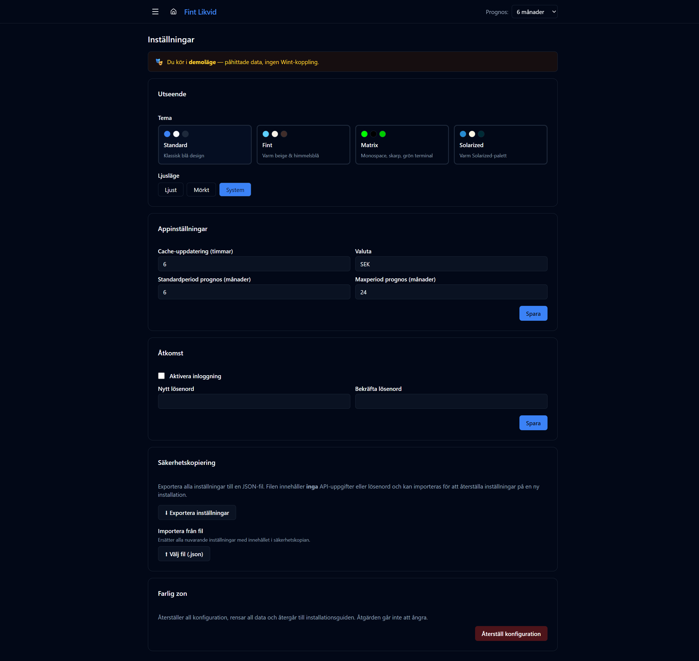

# Inställningar

URL: `/settings`

Anpassa utseende, systembeteende, åtkomst och säkerhetskopiering.

## Utseende

### Tema
Välj ett av fyra visuella teman:

| Tema | Beskrivning |
|------|-------------|
| Standard | Klassisk blå design |
| Fint | Varm beige & himmelsblå |
| Matrix | Monospace, skarp, grön terminal |
| Solarized | Varm Solarized-palett |

### Ljusläge
Välj **Ljust**, **Mörkt** eller **System** (följer operativsystemets inställning).

## Appinställningar

| Inställning | Standardvärde | Beskrivning |
|-------------|--------------|-------------|
| Cache-uppdatering (timmar) | 6 | Hur ofta data hämtas automatiskt från Wint API |
| Valuta | SEK | Valuta som visas i hela appen |
| Standardperiod prognos (månader) | 6 | Förvald prognosperiod vid öppning |
| Maxperiod prognos (månader) | 24 | Längsta tillåtna prognosperiod i dropdown |

Klicka **Spara** för att tillämpa ändringarna.

## Åtkomst

Aktivera lösenordsskydd för appen. Kryssa i **Aktivera inloggning** och ange ett nytt lösenord (bekräfta i det andra fältet). Klicka **Spara**.

## Säkerhetskopiering

### Exportera
Laddar ned en JSON-fil med alla dina inställningar (löner, planerade fakturor, återkommande fakturor, löpande kostnader m.m.). Filen innehåller **inga** API-uppgifter eller lösenord och kan importeras på en ny installation.

### Importera
Välj en tidigare exporterad JSON-fil för att återställa alla inställningar. Befintliga inställningar ersätts helt.

## Farlig zon

**Återställ konfiguration** — rensar all data och konfiguration och återgår till installationsguiden. Åtgärden går inte att ångra. En bekräftelsedialog visas innan återställning genomförs.

---

> I demoläge visas ett meddelande: *"Du kör i demoläge — påhittade data, ingen Wint-koppling."*
