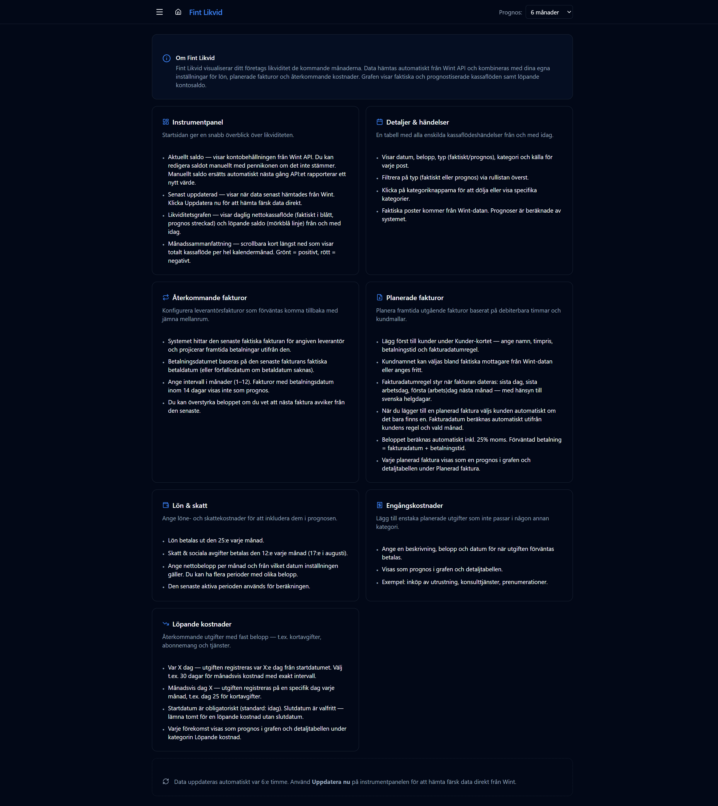

# Hjälp

URL: `/help`

Inbyggd hjälpsida med förklaringar av alla delar i appen.

## Innehåll

Hjälpsidan täcker varje sektion i appen med korta, praktiska förklaringar:

- **Om Fint Likvid** — övergripande beskrivning av vad appen gör
- **Instrumentpanel** — saldo, graf och månadssammanfattning
- **Detaljer & händelser** — filtrering och kolumnbeskrivningar
- **Återkommande fakturor** — hur projicering av leverantörsfakturor fungerar
- **Planerade fakturor** — kundmallar, timbaserad beräkning och fakturadatumregler
- **Lön & skatt** — utbetalningsdagar och perioder
- **Engångskostnader** — användningsexempel
- **Löpande kostnader** — skillnaden mellan "var X dag" och "månadsvis dag X"

Längst ned på sidan finns en påminnelse om att data uppdateras automatiskt var 6:e timme och att **Uppdatera nu** på instrumentpanelen hämtar data direkt.

## Läs mer

Se de övriga dokumentationsfilerna för detaljerade förklaringar av varje sida:

- [Instrumentpanel](01-dashboard.md)
- [Detaljer & händelser](02-details.md)
- [Återkommande fakturor](03-recurring-invoices.md)
- [Planerade fakturor](04-future-invoices.md)
- [Lön & skatt](05-salary-settings.md)
- [Engångskostnader](06-one-off-expenses.md)
- [Löpande kostnader](07-periodic-expenses.md)
- [Inställningar](08-settings.md)
