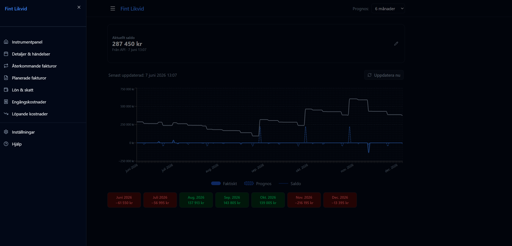

# Fint Likvid — Dokumentation

Fint Likvid är en finansiell likviditetsapp som visar faktiska och prognostiserade kassaflöden för de kommande 1–24 månaderna. Data hämtas automatiskt från Wint API och kombineras med manuellt konfigurerade lönekostnader, planerade fakturor och återkommande utgifter.

## Innehåll

| Sida | URL | Beskrivning |
|------|-----|-------------|
| [Instrumentpanel](01-dashboard.md) | `/` | Saldo, likviditetsgraf och månadssammanfattning |
| [Detaljer & händelser](02-details.md) | `/details` | Filtrerbar tabell med alla kassaflödeshändelser |
| [Återkommande fakturor](03-recurring-invoices.md) | `/recurring` | Projicera leverantörsfakturor som upprepas |
| [Planerade fakturor](04-future-invoices.md) | `/future-invoices` | Planera utgående fakturor baserat på timmar |
| [Lön & skatt](05-salary-settings.md) | `/salary` | Konfigurera löne- och skattebelopp |
| [Engångskostnader](06-one-off-expenses.md) | `/expenses` | Lägg till enstaka planerade utgifter |
| [Löpande kostnader](07-periodic-expenses.md) | `/periodic` | Återkommande fasta utgifter |
| [Inställningar](08-settings.md) | `/settings` | Tema, cacheintervall, säkerhetskopiering |
| [Hjälp](09-help.md) | `/help` | Inbyggd hjälptext för alla delar |

## Navigation

Navigering sker via hamburgermenyn uppe till vänster. Prognosperioden (1–24 månader) väljs i dropdown-listan i headern och påverkar samtliga vyer direkt.

